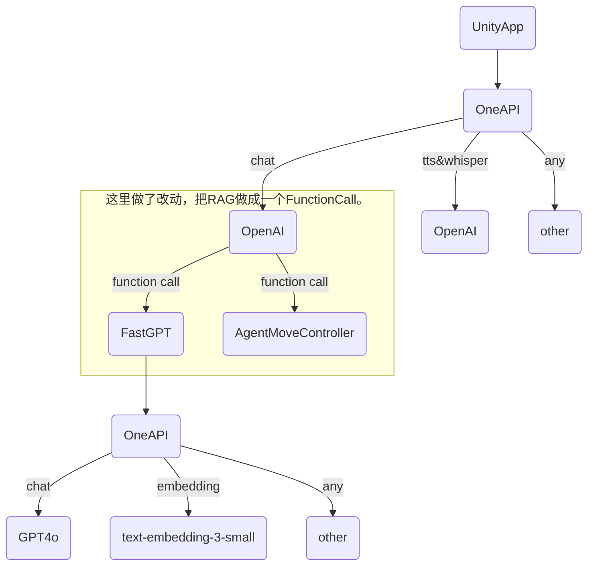

# Architecture

```mermaid
flowchart TD
    subgraph comment1 [这里做了改动，把RAG做成一个FunctionCall。]
        OpenAI
        FastGPT
        AgentMoveController
    end
    UnityApp(UnityApp)
    OneAPI_1(OneAPI)
    OpenAI_1(OpenAI)
    OpenAI(OpenAI)
    FastGPT(FastGPT)
    AgentMoveController(AgentMoveController)
    OneAPI_2(OneAPI)
    GPT4o(GPT4o)
    text-embedding-3-small(text-embedding-3-small)
    
	UnityApp --> OneAPI_1
	OneAPI_1 --tts&whisper--> OpenAI_1
	OneAPI_1 --chat--> OpenAI
	OneAPI_1 --any--> other1(other)
	
	OpenAI --function call--> FastGPT
	OpenAI --function call--> AgentMoveController

	FastGPT --> OneAPI_2
	OneAPI_2 --chat--> GPT4o
	OneAPI_2 --embedding--> text-embedding-3-small
	OneAPI_2 --any--> other2(other)
	
```

